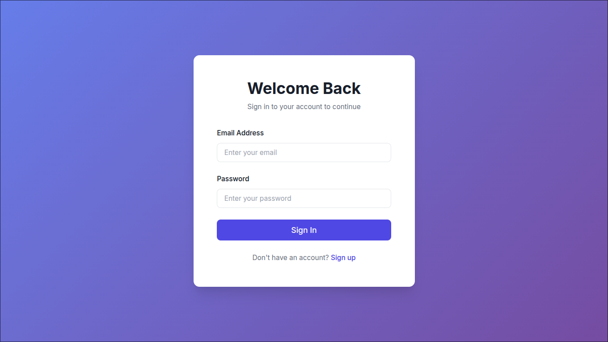
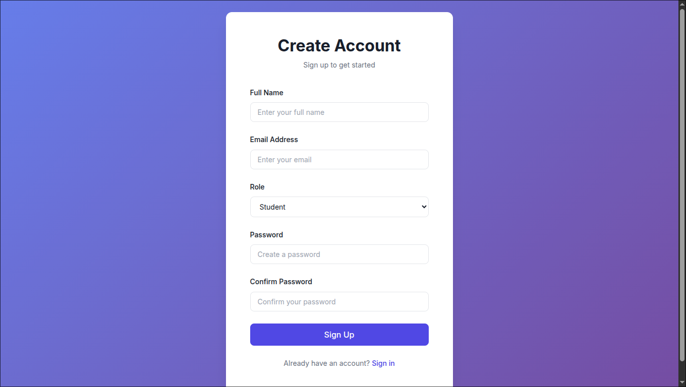
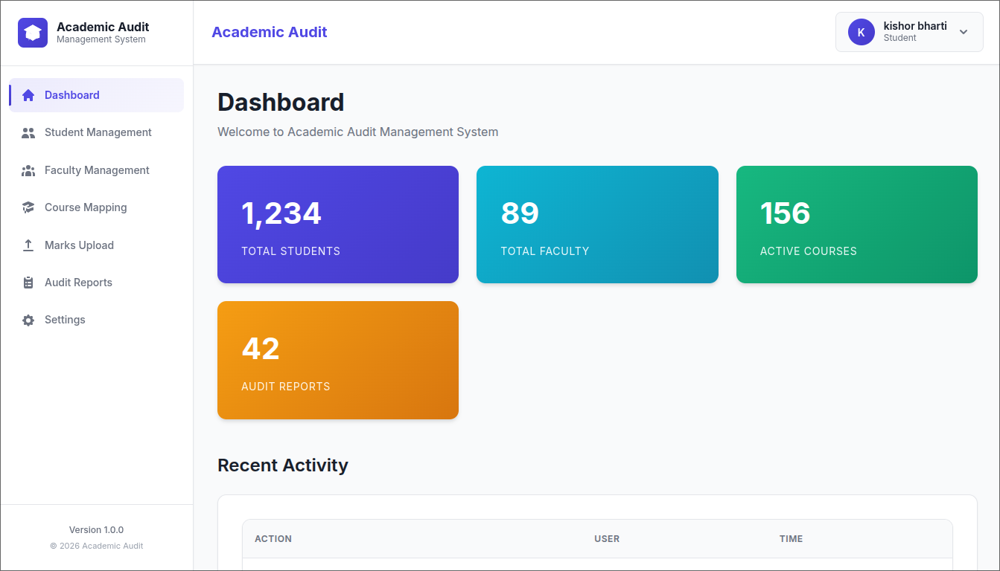
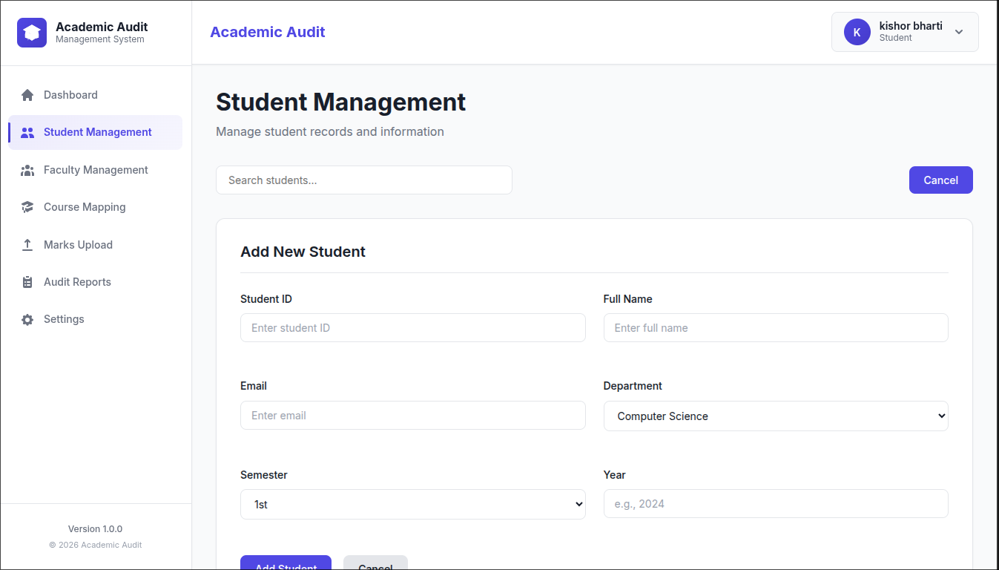
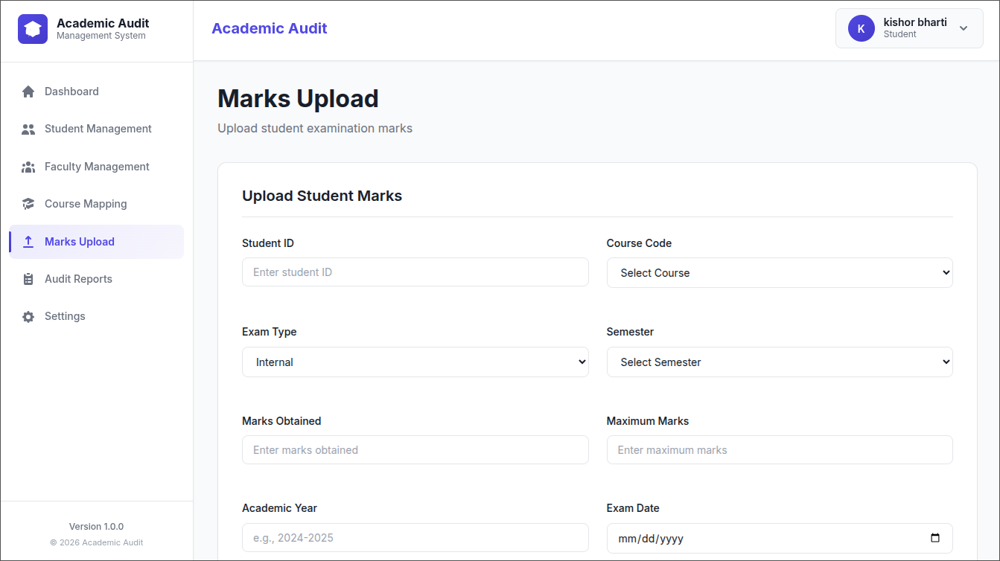

# 🎓 Academic Audit Module

A full-stack Academic Audit Management System for colleges/universities.

---

## 🏗 Tech Stack

**Frontend**
- React (Vite)
- Axios
- React Router v6

**Backend**
- ASP.NET Core Web API (.NET 10)
- Entity Framework Core 10
- JWT Authentication

**Database**
- PostgreSQL

---

## 📸 Application Demo

### 🔐 Authentication

<p align="center">
  
  
</p>

### 📊 Dashboard

<p align="center">
  
</p>

### 👨‍🎓 Student Management

<p align="center">
  
</p>

### 📝 Marks Upload

<p align="center">
  
</p>

### 📑 Audit Reports

<p align="center">
  
</p>

---

## 🚀 Windows Setup Guide (Main Branch - .NET 10)

⚠ **This branch requires .NET 10 SDK**

### ✅ 1. Install Required Software

**1️⃣ Install Node.js (LTS)**  
Download:  
https://nodejs.org  

Verify:  
```bash
node -v
npm -v
```

**2️⃣ Install PostgreSQL (v15+)**  
Download:  
https://www.postgresql.org/download/windows/  
> During installation, remember your password and default port: 5432

**3️⃣ Install .NET 10 SDK (x64)**  
Download:  
https://dotnet.microsoft.com/download  

Verify:  
```bash
dotnet --version
```
Expected output: `10.0.xxx`

---

### 📂 2. Clone Repository
```bash
git clone <your-repository-url>
cd Academic-Audit-Module
git checkout main
```

---

### 🗄 3. Setup Database

Open PowerShell:
```bash
psql -U postgres
```
Create database:
```sql
CREATE DATABASE academicaudit;
```
Exit:
```
\q
```

---

### ⚙ 4. Setup Backend
```bash
cd server
dotnet restore
dotnet build
dotnet run
```
Backend should start on:
> http://localhost:5001

---

### 💻 5. Setup Frontend
```bash
cd client
npm install
npm run dev
```
Frontend runs on:
> http://localhost:5173

---

### 🔗 6. Verify API Connection

Ensure `client/src/api/axios.js` contains:
```js
baseURL: "http://localhost:5001/api"
```

Open:  
http://localhost:5173

Test:
- Register
- Login

If successful → setup complete 🎉

---

## 🗄 Database Schema (PostgreSQL)

If you prefer manual schema setup instead of migrations, run the following SQL:

```sql
CREATE DATABASE academicaudit;

DROP TABLE IF EXISTS "Marks" CASCADE;
DROP TABLE IF EXISTS "AuditReports" CASCADE;
DROP TABLE IF EXISTS "Courses" CASCADE;
DROP TABLE IF EXISTS "Faculties" CASCADE;
DROP TABLE IF EXISTS "Students" CASCADE;
DROP TABLE IF EXISTS "Users" CASCADE;

CREATE TABLE "Users" (
    id SERIAL PRIMARY KEY,
    full_name VARCHAR(150) NOT NULL,
    email VARCHAR(255) NOT NULL UNIQUE,
    password_hash TEXT NOT NULL,
    role VARCHAR(20) NOT NULL DEFAULT 'Student',
    created_at TIMESTAMP NOT NULL DEFAULT CURRENT_TIMESTAMP,
    updated_at TIMESTAMP NOT NULL DEFAULT CURRENT_TIMESTAMP
);

CREATE INDEX idx_users_email ON "Users"(email);
CREATE INDEX idx_users_role ON "Users"(role);

ALTER TABLE "Users" ADD CONSTRAINT chk_user_role 
CHECK (role IN ('Student', 'Faculty', 'Admin'));

CREATE TABLE "Students" (
    id SERIAL PRIMARY KEY,
    student_id VARCHAR(50) NOT NULL UNIQUE,
    full_name VARCHAR(100) NOT NULL,
    email VARCHAR(100) NOT NULL UNIQUE,
    department VARCHAR(50),
    semester VARCHAR(20),
    year VARCHAR(20),
    enrollment_date TIMESTAMP DEFAULT CURRENT_TIMESTAMP,
    created_at TIMESTAMP DEFAULT CURRENT_TIMESTAMP,
    updated_at TIMESTAMP DEFAULT CURRENT_TIMESTAMP
);

CREATE TABLE "Faculties" (
    id SERIAL PRIMARY KEY,
    faculty_id VARCHAR(50) NOT NULL UNIQUE,
    full_name VARCHAR(100) NOT NULL,
    email VARCHAR(100) NOT NULL UNIQUE,
    department VARCHAR(50),
    specialization VARCHAR(100),
    designation VARCHAR(20),
    joining_date TIMESTAMP DEFAULT CURRENT_TIMESTAMP,
    created_at TIMESTAMP DEFAULT CURRENT_TIMESTAMP,
    updated_at TIMESTAMP DEFAULT CURRENT_TIMESTAMP
);

CREATE TABLE "Courses" (
    id SERIAL PRIMARY KEY,
    course_code VARCHAR(50) NOT NULL UNIQUE,
    course_name VARCHAR(200) NOT NULL,
    department VARCHAR(50),
    semester VARCHAR(20),
    credits INTEGER DEFAULT 0,
    description VARCHAR(500),
    faculty_id INTEGER,
    created_at TIMESTAMP DEFAULT CURRENT_TIMESTAMP,
    updated_at TIMESTAMP DEFAULT CURRENT_TIMESTAMP
);

CREATE TABLE "Marks" (
    id SERIAL PRIMARY KEY,
    student_id INTEGER NOT NULL,
    course_id INTEGER NOT NULL,
    exam_type VARCHAR(50) NOT NULL,
    marks_obtained DECIMAL(5,2) NOT NULL,
    max_marks DECIMAL(5,2) NOT NULL,
    semester VARCHAR(20),
    year VARCHAR(20),
    exam_date TIMESTAMP NOT NULL,
    created_at TIMESTAMP DEFAULT CURRENT_TIMESTAMP,
    updated_at TIMESTAMP DEFAULT CURRENT_TIMESTAMP
);

CREATE TABLE "AuditReports" (
    id SERIAL PRIMARY KEY,
    report_title VARCHAR(200) NOT NULL,
    report_type VARCHAR(50),
    department VARCHAR(50),
    semester VARCHAR(20),
    year VARCHAR(20),
    report_data TEXT,
    status VARCHAR(50) DEFAULT 'Draft',
    generated_by INTEGER NOT NULL,
    generated_at TIMESTAMP DEFAULT CURRENT_TIMESTAMP,
    created_at TIMESTAMP DEFAULT CURRENT_TIMESTAMP,
    updated_at TIMESTAMP DEFAULT CURRENT_TIMESTAMP
);
```

---

## 🛠 Troubleshooting

**🔴 Port Already In Use**

```powershell
Get-Process dotnet
Stop-Process -Name dotnet -Force
```

**🔴 Database Connection Error**  
Check your connection string:

```json
"ConnectionStrings": {
  "DefaultConnection": "Host=localhost;Port=5432;Database=academicaudit;Username=postgres;Password=YOUR_PASSWORD"
}
```

---

## 📌 Recommended (Prevent SDK Issues)

Create `global.json` at the project root:

```json
{
  "sdk": {
    "version": "10.0.103"
  }
}
```

---

## 🌿 Branch Strategy

- `main` → .NET 10 (Windows environment)
- `arch` → .NET 8 (Linux environment)

---

## 📄 License

This project is developed as part of an academic initiative.

---

## 👨‍💻 Author

Kishor Bharti